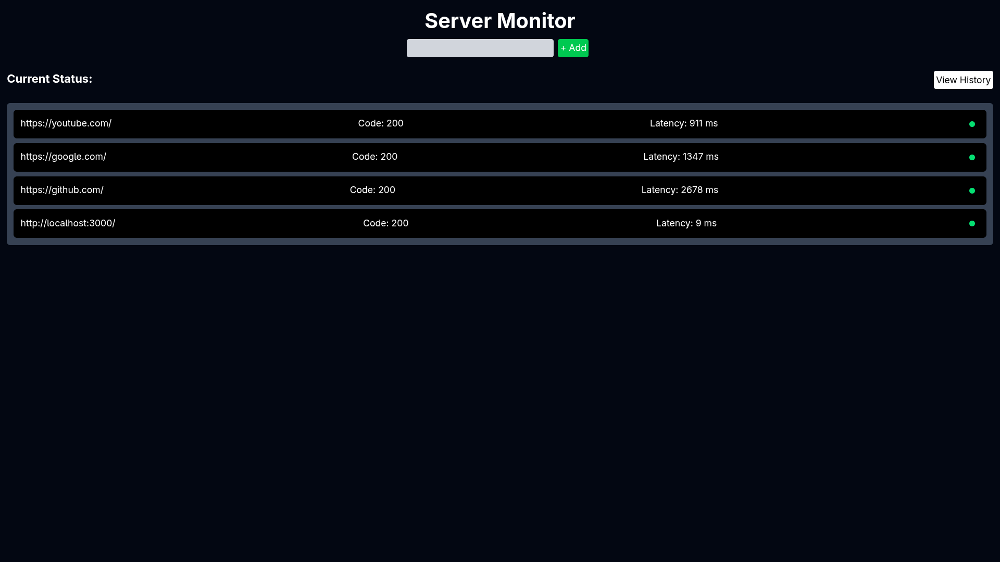
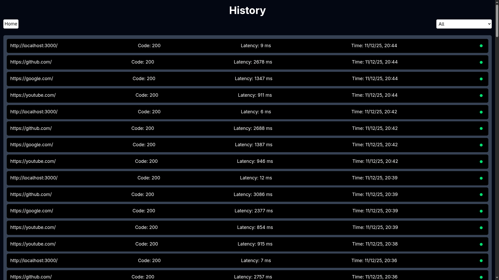
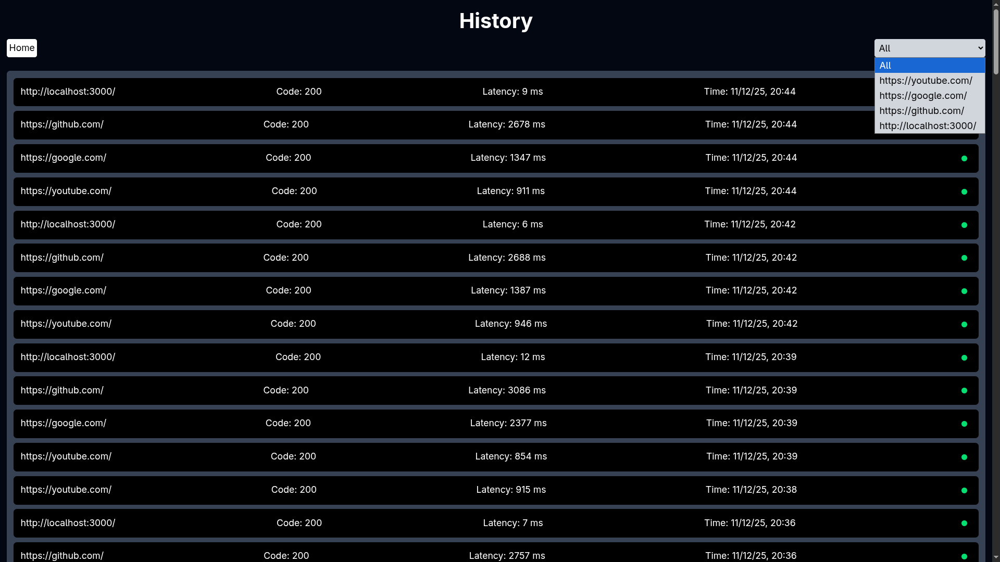

# 🚀 Server Monitor

A lightweight, extensible uptime & health-check system built with **Node.js**, **Express**, **MongoDB**, **node-cron**, **axios**, **Tailwind CSS**, **Vanilla JS**, and **Nodemailer**.

This service periodically checks endpoints, logs results into MongoDB, provides a dashboard UI, and sends email alerts when monitored services go down.


## ✨ Features

- 🔄 Automated health checks powered by node-cron  
- 🌐 Filter option in the history log
- 🗄 Persistent storage using **MongoDB**  
- 📡 Fast HTTP checks with axios  
- 📊 Dashboard UI (Tailwind + Vanilla JS) to view monitor status  
- 📧 Email alerts using Nodemailer  
## Screenshots
<div style="display: flex; gap: 10px; flex-wrap: wrap;">
  
  
  
</div>

## 📦 Installation

1. Clone the repo
```bash
git clone <your-repo-url>
cd server-monitor
```
2. Create .env and add the following
```bash
MONGO_URL="[URL]"
EMAIL_USER=[USER]
EMAIL_PASS=[PASS]
```

3.Install dependencies
```bash
npm install
```

4.Run the server
```bash
node server.js
```

5. Open the browser
```bash
http://localhost:3000/
```

